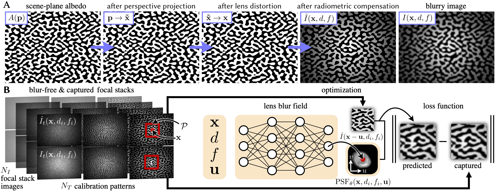

# Learning Lens Blur Fields
Official code release for [Learning Lens Blur Fields](https://arxiv.org/abs/2310.11535). For additional details, please refer to:

If you use parts of this work, or otherwise take inspiration from it, please considering citing our paper:

```
@misc{lin2023learning,
      title={Learning Lens Blur Fields}, 
      author={Esther Y. H. Lin and 
        Zhecheng Wang and 
        Rebecca Lin and 
        Daniel Miau and 
        Florian Kainz and 
        Jiawen Chen and 
        Xuaner Cecilia Zhang and 
        David B. Lindell and 
        Kiriakos N. Kutulakos},
      year={2023},
      eprint={2310.11535},
      archivePrefix={arXiv},
      primaryClass={eess.IV}
}
```

## Directory Structure

```
blur-fields
  ├── models  
  │   └── iphone12pro0-wide.pth // iphone 12 pro model 0 in paper
  │   └── iphone12pro1-wide.pth // iphone 12 pro model 1 in paper
  ├── config
  │   ├── iphone12pro-wide.json  // MLP configuration
  ├── util
  │   └── utils.py  // misc helper functions 
  │   └── preprocess.py  // helper functions (e.g. homographies, centre detections)
  │   └── generate_random_pattern.py  // generates random binary noise images
  ├── run
  │   └── download_data.sh  // for iphone 12 pro wide used in paper
  │   └── train_iphone12pro_wide.sh  // for iphone 12 pro wide used in paper
  ├── notebooks
  │   └── preprocess_iphone12pro.ipynb  // demo of preprocessing pipeline
  │   └── visualize_blur_field.ipynb  // how to extract psfs after training
  ├── README.md  // <- You Are Here
  ├── requirements.txt  // package requirements
  └── train.py  // training code for 5D blur field
```

## Getting Started

### Requirements

This code requires tiny-cuda-nn, see [NVlabs/tiny-cuda-nn](https://github.com/NVlabs/tiny-cuda-nn) for installation instructions (we used version 1.6).

### Data

#### Downloading iPhone 12 Pro Data

You can download the iPhone 12 pro device 0 wide lens data used in the paper here:

1.  4x downsampled processed data: can directly be used in colab demos
2.  ​

#### Using Your Own Data

##### Capturing

TODO

##### Preprocessing (preparing data for training)



TODO

### Training

A training example using `train.py` can be found in `run/train_iphone12pro_wide.sh`. 

## Acknowledgements

We thank Wenzheng Chen for providing discussions and the script for generating random noise patterns. 